# GaFi — Entity Relationship Diagram (Active Tables Only)

Scope: the **26 tables actually used by the app** (see `GaFi_Tables_Usage_Analysis.txt`).
`auth_users` is Supabase's built-in `auth.users` table — shown because nearly every
table has a FK to it, but it is not part of the `public` schema you maintain.

Relationship cardinality:
- `||--||` one-to-one (table has a **UNIQUE** `user_id`, i.e. one row per user)
- `||--o{` one-to-many
- `||--o|` one-to-(zero-or-one)

```mermaid
erDiagram
    auth_users ||--|| profiles : "has profile"
    auth_users ||--|| budgets : "has"
    auth_users ||--o{ expenses : "logs"
    auth_users ||--o{ budget_alerts : "has"
    auth_users ||--o{ notes : "writes"
    auth_users ||--|| budgets_custom_mode : "has"
    auth_users ||--o{ goals_custom_mode : "sets"
    auth_users ||--o{ goal_contributions_custom_mode : "makes"
    auth_users ||--o{ savings_accounts_custom_mode : "owns"
    auth_users ||--o{ savings_logs_custom_mode : "logs"
    auth_users ||--|| user_levels : "has"
    auth_users ||--o{ story_mode_sessions : "plays"
    auth_users ||--o{ custom_mode_sessions : "plays"
    auth_users ||--o{ transport_expenses : "incurs"
    auth_users ||--|| character_customizations : "has"
    auth_users ||--o{ game_activity_log : "generates"
    auth_users ||--|| tutorial_progress : "has"
    auth_users ||--o{ user_learning_progress : "tracks"
    auth_users ||--o{ user_quiz_results : "takes"
    auth_users ||--o{ user_favorite_tips : "favorites"
    auth_users ||--|| user_learning_stats : "has"
    auth_users ||--o{ user_achievements : "earns"
    auth_users ||--|| updated_leaderboard : "ranked in"
    auth_users ||--o{ push_tokens : "registers"
    auth_users ||--o{ friends : "requests (user_id)"
    auth_users ||--o{ friends : "is friend (friend_id)"

    budgets ||--o{ budget_categories : "contains"
    budgets ||--o{ budget_alerts : "triggers"
    goals_custom_mode ||--o{ goal_contributions_custom_mode : "receives"
    savings_accounts_custom_mode ||--o{ savings_logs_custom_mode : "holds"
    expenses ||--o| transport_expenses : "detailed by"

    auth_users {
        uuid id PK
    }

    profiles {
        uuid id PK "FK auth.users"
        text full_name
        text email "UNIQUE"
        varchar username "UNIQUE"
        varchar user_type "student | employee"
        varchar selected_character
        jsonb character_customizations
        text avatar_url
        bool onboarding_completed
        bool tutorial_completed
        timestamptz created_at
        timestamptz updated_at
    }

    budgets {
        uuid id PK
        uuid user_id FK "UNIQUE"
        varchar currency
        varchar budget_period
        numeric monthly
        numeric weekly
        timestamptz created_at
        timestamptz updated_at
    }

    budget_categories {
        uuid id PK
        uuid budget_id FK
        varchar category_name
        numeric allocated_amount
        numeric spent_amount
        timestamptz created_at
        timestamptz updated_at
    }

    expenses {
        uuid id PK
        uuid user_id FK
        numeric amount
        varchar category
        varchar sub_category
        text note
        timestamptz date
        text created_via "user | chatbot"
        numeric confidence_score
        bool needs_review
        text natural_language_input
        varchar location
        varchar recorded_from
        uuid game_session_id "soft ref"
        text app_mode "story | custom"
        timestamptz created_at
        timestamptz updated_at
    }

    budget_alerts {
        uuid id PK
        uuid user_id FK
        uuid budget_id FK
        varchar alert_type
        varchar category
        int threshold_percentage
        numeric amount
        text message
        bool is_active
        timestamptz triggered_at
        timestamptz created_at
    }

    notes {
        uuid id PK
        uuid user_id FK
        text title
        text content
        timestamptz created_at
        timestamptz updated_at
    }

    budgets_custom_mode {
        uuid id PK
        uuid user_id FK "UNIQUE"
        numeric total_income
        int needs_pct
        int wants_pct
        int savings_pct
        timestamptz updated_at
    }

    goals_custom_mode {
        uuid id PK
        uuid user_id FK
        text title
        numeric target_amount
        numeric current_amount
        date target_date
        bool is_completed
        bool is_deleted
        timestamptz achieved_at
        timestamptz deleted_at
        jsonb notifications_sent
        timestamptz created_at
    }

    goal_contributions_custom_mode {
        uuid id PK
        uuid user_id FK
        uuid goal_id FK
        numeric amount
        timestamptz contributed_at
    }

    savings_accounts_custom_mode {
        uuid id PK
        uuid user_id FK
        text name
        text location_type
        timestamptz created_at
    }

    savings_logs_custom_mode {
        uuid id PK
        uuid user_id FK
        uuid account_id FK
        numeric amount
        text location
        timestamptz logged_at
    }

    user_levels {
        uuid id PK
        uuid user_id FK "UNIQUE"
        int current_level
        int total_xp
        varchar level_name
        bool story_level_1_completed
        bool story_level_2_completed
        bool story_level_3_completed
        int story_level_1_stars
        int story_level_2_stars
        int story_level_3_stars
        int total_story_stars
        int custom_mode_completions
        int custom_mode_passed
        int total_expenses_recorded
        int total_maps_traveled
        int total_goals_achieved
        int achievements_earned
        numeric total_saved
        int goals_completed
        int streak_days
        date last_save_date
        bool intro_seen_level_1
        bool intro_seen_level_2
        bool intro_seen_level_3
        timestamptz created_at
        timestamptz updated_at
    }

    story_mode_sessions {
        uuid id PK
        uuid user_id FK
        int level "1-3"
        varchar level_type "budgeting | goals | saving"
        varchar level_name
        numeric weekly_budget
        numeric weekly_spending
        numeric needs_budget
        numeric needs_spent
        numeric wants_budget
        numeric wants_spent
        numeric savings_budget
        numeric savings_amount
        jsonb goals_data
        numeric total_allocated
        numeric savings_goal_percent
        numeric actual_savings_percent
        jsonb category_spending
        timestamptz start_date
        timestamptz end_date
        varchar status
        bool passed
        int stars_earned
        jsonb results_data
        int xp_earned
        timestamptz created_at
        timestamptz completed_at
        timestamptz updated_at
    }

    custom_mode_sessions {
        uuid id PK
        uuid user_id FK
        varchar mode_type "budgeting | goals | saving"
        jsonb custom_rules
        numeric weekly_budget
        numeric weekly_spending
        numeric needs_spent
        numeric wants_spent
        numeric savings_amount
        jsonb category_spending
        jsonb custom_goals
        jsonb goals_progress
        numeric custom_savings_target
        timestamptz start_date
        timestamptz end_date
        varchar status
        bool passed
        jsonb results_data
        int xp_earned
        timestamptz created_at
        timestamptz completed_at
        timestamptz updated_at
    }

    transport_expenses {
        uuid id PK
        uuid user_id FK
        uuid expense_id FK
        uuid session_id "soft ref"
        varchar transport_mode "commute | car | walk"
        varchar origin_map
        varchar destination_map
        numeric fare_amount
        numeric fuel_amount
        timestamptz created_at
    }

    character_customizations {
        uuid id PK
        uuid user_id FK "UNIQUE"
        varchar selected_character
        array unlocked_characters
        array unlocked_outfits
        array unlocked_accessories
        varchar equipped_outfit
        array equipped_accessories
        jsonb customization_data
        timestamptz created_at
        timestamptz updated_at
    }

    game_activity_log {
        uuid id PK
        uuid user_id FK
        uuid session_id "soft ref"
        varchar activity_type
        varchar map_id
        varchar location_id
        jsonb details
        numeric amount
        int xp_earned
        timestamptz created_at
    }

    tutorial_progress {
        uuid id PK
        uuid user_id FK "UNIQUE"
        bool tutorial_completed
        int current_step
        array steps_completed
        timestamptz started_at
        timestamptz completed_at
        timestamptz created_at
        timestamptz updated_at
    }

    user_learning_progress {
        uuid id PK
        uuid user_id FK
        varchar module_id
        varchar lesson_id
        bool completed
        int score
        timestamptz completed_at
        timestamptz created_at
        timestamptz updated_at
    }

    user_quiz_results {
        uuid id PK
        uuid user_id FK
        varchar quiz_id
        varchar lesson_id
        varchar tip_id
        int selected_answer
        int correct_answer
        bool is_correct
        int attempts
        bool first_attempt_correct
        timestamptz completed_at
        timestamptz created_at
    }

    user_favorite_tips {
        uuid id PK
        uuid user_id FK
        varchar tip_id
        timestamptz favorited_at
    }

    user_learning_stats {
        uuid id PK
        uuid user_id FK "UNIQUE"
        int total_lessons_completed
        int total_quizzes_taken
        int total_tips_favorited
        numeric average_quiz_score
        int learning_streak_days
        date last_activity_date
        timestamptz created_at
        timestamptz updated_at
    }

    user_achievements {
        uuid id PK
        uuid user_id FK
        varchar achievement_id
        varchar achievement_title
        text achievement_description
        int points
        timestamptz unlocked_at
    }

    friends {
        uuid id PK
        uuid user_id FK
        uuid friend_id FK
        uuid requested_by FK
        varchar status "pending | accepted | blocked | declined"
        timestamptz requested_at
        timestamptz accepted_at
        timestamptz updated_at
    }

    updated_leaderboard {
        uuid user_id PK "FK auth.users"
        varchar username
        varchar full_name
        int total_points
        int achievements_count
        timestamptz last_updated
    }

    push_tokens {
        uuid id PK
        uuid user_id FK
        text token "UNIQUE"
        text platform
        timestamptz created_at
        timestamptz updated_at
    }
```

## Notes for ERD accuracy

- **`auth_users`** = Supabase `auth.users`. Every `user_id` / `profiles.id` /
  `updated_leaderboard.user_id` FK points here.
- **Soft references (no DB-level FK constraint)** — drawn as plain `uuid` columns,
  not relationship lines, because the schema declares no `FOREIGN KEY` for them:
  - `expenses.game_session_id` → a story/custom session
  - `transport_expenses.session_id` → a session
  - `game_activity_log.session_id` → a session
- **`friends`** has three FKs to `auth_users`: `user_id`, `friend_id`, and
  `requested_by` (the requester). Only `user_id` and `friend_id` are drawn to keep
  the diagram readable.
- **One-to-one tables** (UNIQUE `user_id`): `budgets`, `budgets_custom_mode`,
  `user_levels`, `character_customizations`, `tutorial_progress`,
  `user_learning_stats`, plus `profiles` and `updated_leaderboard` (user id is the PK).
